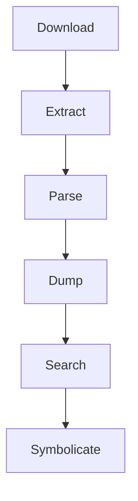

<p align="center">
  <a href="https://github.com/blacktop/ipsw"></a>
  <h1 align="center">ipsw</h1>
  <h4><p align="center">iOS/macOS Research Swiss Army Knife</p></h4>
  <p align="center">
    <a href="https://github.com/blacktop/ipsw/actions" alt="Actions">
          </a>
    <a href="https://github.com/blacktop/ipsw/releases/latest" alt="Downloads">
          </a>
    <a href="https://github.com/blacktop/ipsw/releases" alt="GitHub Release">
          </a>
    <a href="http://doge.mit-license.org" alt="LICENSE">
          </a>
</p>
<br>

## What is `ipsw` 🤔

- IPSW downloader/exploder
- OTA downloader/exploder
- macho parser
- ObjC class-dump
- Swift class-dump 🚧
- dyld_shared_cache parser
- kernelcache parser
- img4 parser/decrypter
- device-tree parser
- ARM v9-a disassember
- research tool

## Install

### macOS

```bash
brew install blacktop/tap/ipsw
```

### Linux

```bash
sudo snap install ipsw
```

### Windows

```bash
scoop bucket add blacktop https://github.com/blacktop/scoop-bucket.git 
scoop install blacktop/ipsw
```

## Getting Started

```
❯ ipsw

Download and Parse IPSWs (and SO much more)

Usage:
  ipsw [command]

Available Commands:
  appstore        Interact with the App Store Connect API
  device-list     List all iOS devices
  diff            Diff IPSWs
  download        Download Apple Firmware files (and more)
  dtree           Parse DeviceTree
  dyld            Parse dyld_shared_cache
  ent             Search IPSW filesystem DMG for MachOs with a given entitlement
  extract         Extract kernelcache, dyld_shared_cache or DeviceTree from IPSW/OTA
  help            Help about any command
  iboot           Dump firmwares
  idev            USB connected device commands
  img4            Parse Img4
  info            Display IPSW/OTA Info
  kernel          Parse kernelcache
  macho           Parse MachO
  mdevs           List all MobileDevices in IPSW
  mount           Mount DMG from IPSW
  ota             Parse OTAs
  plist           Dump plist as JSON
  sepfw           Dump MachOs
  ssh             SSH into a jailbroken device
  symbolicate     Symbolicate ARM 64-bit crash logs (similar to Apple's symbolicatecrash)
  update          Download an ipsw update if one exists
  version         Print the version number of ipsw
  watch           Watch Github Commits

Flags:
      --color           colorize output
      --config string   config file (default is $HOME/.config/ipsw/config.yaml)
  -h, --help            help for ipsw
  -V, --verbose         verbose output

Use "ipsw [command] --help" for more information about a command.
```

## Documentation

- [https://blacktop.github.io/ipsw](https://blacktop.github.io/ipsw)



## Community

You have questions, need support and or just want to talk about `ipsw`?

Here are ways to get in touch with the `ipsw` community:

[](https://twitter.com/blacktop__)
[](https://mastodon.social/@blacktop)
[](https://github.com/blacktop/ipsw/discussions)

## Known Issues

- `macOS` IPSW etc support is sometimes broken
  
  Automated testing of `ipsw` is challenging as it requires a lot of resources to test all the different IPSW flavors and OS versions etc. No CI/CD can really handle that unless I want to wait forever for it to run on each commit. Please create an [issue](https://github.com/blacktop/ipsw/issues) and I'll fix it as soon as I can ❤️ *(**NOTE:** a comprehensive test suite is in the roadmap so I can at least test on the few local IPSWs I have)*
  
## Credit

Big shout out to Jonathan Levin's amazing books and his legendary `jtool`

## License

MIT Copyright (c) 2018-2024 **blacktop**
