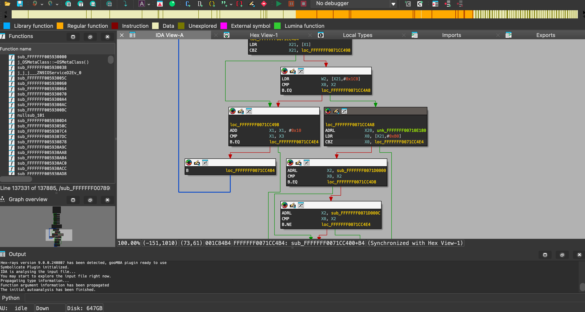

## 🔐 Unlocking the Power of Kernelcache Symbolication

In the world of reverse engineering and kernel analysis, being able to **symbolicate** a stripped Apple **kernelcache** is a game-changer. With the latest feature added to `ipsw`, you can now effortlessly symbolicate a kernelcache, even when it’s stripped of symbols. To make it even better, we’ve integrated this functionality directly into IDA Pro via a brand new [plugin](https://github.com/blacktop/symbolicator/tree/main/plugins/ida), streamlining the entire process for you.

### A Quick Demo: Symbolicating a Kernelcache in IDA Pro

Let’s jump straight into the action. Here’s how you can use the new feature:

1. Install the `ipsw` tool from [GitHub](https://github.com/blacktop/ipsw) if you haven't already.
2. Fetch the latest **kernelcache** you’re interested in:
   ```bash
   ❯ ipsw dl appledb --os iOS \
                     --device iPhone16,2 \
                     --version 18.1 \
                     --beta \
                     --latest \
                     --kernel
                 
      • Querying AppleDB...
         • Updating 'appledb' repo ~/.config/ipsw/appledb
      • Parsing remote IPSW   build=22B5023e devices=iPhone16,2 version=18.1
      • Extracting remote kernelcache
         • Created 22B5023e__iPhone16,2/kernelcache.release.iPhone16,2
   ```
3. Check how many symbols we have to start with:
   ```bash
   ❯ ipsw macho info --fileset-entry com.apple.kernel \
     '22B5023e__iPhone16,2/kernelcache.release.iPhone16,2' | grep LC_SYMTAB

   021: LC_SYMTAB Symbol offset=0x03AD8000, Num Syms: '0'
   ```
4. Get the **latest** signature files:
   ```bash
   ❯ git clone https://github.com/blacktop/symbolicator.git
   ```
5. Use the new feature to **symbolicate** it:
   ```bash
   ❯ ipsw kernel symbolicate --signatures 'symbolicator/kernel' --json \
                '22B5023e__iPhone16,2/kernelcache.release.iPhone16,2'
      • Parsing Signatures
      • Symbolicating...          kernelcache=kernelcache.release.iPhone16,2
      • Found                     bsd_syscall_table=0xfffffff007a3d3b0
      • Found                     mach_trap_table=0xfffffff007a14028
      • Found                     mig_kern_subsystem table=0xfffffff00a86ca78
      • Analyzing MachO...        name=com.apple.AUC
         • Symbolicated              address=0xfffffff0087cc7bc file=com.apple.AUC symbol=__ZN3AUC5startEP9IOService
         • Symbolicated              address=0xfffffff0087ccd68 file=com.apple.AUC symbol=__ZN3AUC4freeEv
         • Symbolicated              address=0xfffffff0087cd2c8 file=com.apple.AUC symbol=__ZN3AUC30checkForHooverProtocolRequiredEv
            • Symbolicated (Caller)     address=0xfffffff0087cd2c8 file=com.apple.AUC symbol=__ZN3AUC26DPPluggedNotificationGatedEP9IOService
            • Symbolicated (Caller)     address=0xfffffff0087cd2c8 file=com.apple.AUC symbol=__ZN3AUC31call_DPPluggedNotificationGatedEP9IOService
         • Symbolicated              address=0xfffffff0087cc5c4 file=com.apple.AUC symbol=__ZN3AUC25AUCVideoInterfaceMatchingE12IOAVLocation
            • Symbolicated (Caller)     address=0xfffffff0087cc5c4 file=com.apple.AUC symbol=__ZN3AUC26createDisplayNotificationsEv
            • Symbolicated (Caller)     address=0xfffffff0087cc5c4 file=com.apple.AUC symbol=__ZN3AUC5startEP9IOService
         • Symbolicated              address=0xfffffff0087cd6e4 file=com.apple.AUC symbol=__ZN3AUC22InterfaceStatusAndTypeEP18IOAVVideoInterfacePjS2_
         <SNIP>
      • Writing symbols as JSON to 22B5023e__iPhone16,2/kernelcache.release.iPhone16,2.symbols.json      
   ```
6. Install the **IDA Pro** [Symbolicate Plugin](https://github.com/blacktop/symbolicator/tree/main/plugins/ida):
   ```bash
   ❯ bash plugins/ida/install.sh
   ```
7. Load the **kernelcache** into **IDA Pro**.
   
8. Press `Alt + F8` and watch as the new plugin kicks in, instantly transforming the stripped **kernelcache** into a fully symbolicated treasure trove of information.

   

:::info notice
#### That's **20k** *NEW* symbols!!
:::

With this new feature, you can now see the NEW symbols directly in IDA Pro, allowing for deeper analysis and a better understanding of the **kernelcache** you’re working with.

:::info NOTE  
We also have plugins for:
- [Binary Ninja](https://github.com/blacktop/symbolicator/tree/main/plugins/binja)  
- [Ghidra](https://github.com/blacktop/symbolicator/tree/main/plugins/ghidra)  
:::  

### Another Demo: `panic` kernel frames **symbolication**

This NEW `ipsw` feature can also be used to enrich a `panic.ips` file:

```bash
❯ ipsw symbolicate --signatures 'symbolicator/kernel' \
    'panic-full-2023-08-04-191003.000.ips' \
    'iPhone_4.7_15.4.1_19E258_Restore.ipsw' 
```
:::info panic
<details>
  <summary><i>BEFORE</i></summary>

```bash
Process: kfd [308] (Panicked)
  Thread: 4293       (Panicked)
    Queue:          com.apple.main-thread
    State:          TH_RUN
    Base Priority:  47
    Sched Priority: 47
    User Time:      1098250 usec
    System Time:    0 usec
    User Frames:
      00: image_2   0x3ab17aac 
      01: image_2   0xc98b700 
      02: image_2   0xc98aaac 
      03: image_355 0xdb58 
      04: image_355 0xdd88 
      05: image_355 0xdd00 
      06: image_355 0x109cc 
      07: image_355 0x10d1c 
      08: image_355 0x184d0 
      09: image_2   0x8134ab8 
      10: image_2   0x7ab6460 
      11: image_2   0x80b5804 
      12: image_2   0x858cd94 
      13: image_2   0x858d578 
      14: image_2   0x36765a8 
      15: image_2   0x3675f28 
      16: image_2   0x3676824 
      17: image_2   0x29a04cc 
      18: image_2   0x28bbb8c 
      19: image_2   0x27ea518 
      20: image_2   0x27eabe4 
      21: image_2   0x27eadb0 
      22: image_2   0x39f21c 
      23: image_2   0x370454 
      24: image_2   0x36b9dc 
      25: image_2   0x37ec30 
      26: image_2   0x20d75988 
      27: image_2   0x2b79c50 
      28: image_2   0x29133d0 
      29: image_2   0x7bb9328 
      30: image_2   0x7b03dfc 
      31: image_2   0x7ae979c 
      32: image_355 0x1d300 
      33: image_355 0x1d3a8 
      34: image_356 0x183d0 
      35: image_1   0x0 
    Kernel Frames:
      00: image_0 0x1007188b20 
      01: image_0 0x1007188b20 
      02: image_0 0x10077cb9e8 
      03: image_0 0x10077cdddc 
      04: image_0 0x100719eb6c 
      05: image_0 0x100719ec7c 
      06: image_0 0x10071689d4 
      07: image_0 0x100717cf3c 
      08: image_0 0x100729aac4 
      09: image_0 0x10072a3808 
      10: image_0 0x1007151594 
      11: image_1 0x0 
```

</details>

<details>
  <summary><i>AFTER</i></summary>

```bash
Process: kfd [308] (Panicked)
  Thread: 4293       (Panicked)
    Queue:          com.apple.main-thread
    State:          TH_RUN
    Base Priority:  47
    Sched Priority: 47
    User Time:      1098250 usec
    System Time:    0 usec
    User Frames:
      00: libsystem_kernel.dylib   0x1bab17aac _mach_msg_trap + 8
      01: IOKit                    0x18c98b700 _io_connect_method + 508
      02: IOKit                    0x18c98aaac _IOConnectCallMethod + 172
      03: image_355 (probably kfd) 0x102b3db58 
      04: image_355 (probably kfd) 0x102b3dd88 
      05: image_355 (probably kfd) 0x102b3dd00 
      06: image_355 (probably kfd) 0x102b409cc 
      07: image_355 (probably kfd) 0x102b40d1c 
      08: image_355 (probably kfd) 0x102b484d0 
      09: SwiftUI                  0x188134ab8 _$s7SwiftUI22DefaultListButtonStyleV0dE0V4bodyQrvgyycAA09PrimitiveeF13ConfigurationVcfu_yycfu0_TA + 20
      10: SwiftUI                  0x187ab6460 _$sIeg_ytIegr_TR + 20
      11: SwiftUI                  0x1880b5804 _$s7SwiftUI16PlatformItemListV26containerSelectionBehaviorAC0D0V0gH0VSgvgyycfU0_Tf2i_n + 56
      12: SwiftUI                  0x18858cd94 _$s7SwiftUI26UITableViewListCoordinatorC05tableD0_14didSelectRowAtySo0cD0C_10Foundation9IndexPathVtF + 448
      13: SwiftUI                  0x18858d578 _$s7SwiftUI26UITableViewListCoordinatorC05tableD0_14didSelectRowAtySo0cD0C_10Foundation9IndexPathVtFToTm + 72
      14: UIKitCore                0x1836765a8 -[UITableView _selectRowAtIndexPath:animated:scrollPosition:notifyDelegate:isCellMultiSelect:deselectPrevious:] + 1640
      15: UIKitCore                0x183675f28 -[UITableView _selectRowAtIndexPath:animated:scrollPosition:notifyDelegate:] + 112
      16: UIKitCore                0x183676824 -[UITableView _userSelectRowAtPendingSelectionIndexPath:] + 316
      17: UIKitCore                0x1829a04cc -[_UIAfterCACommitBlock run] + 64
      18: UIKitCore                0x1828bbb8c -[_UIAfterCACommitQueue flush] + 200
      19: UIKitCore                0x1827ea518 __runAfterCACommitDeferredBlocks + 640
      20: UIKitCore                0x1827eabe4 __cleanUpAfterCAFlushAndRunDeferredBlocks + 128
      21: UIKitCore                0x1827eadb0 __afterCACommitHandler + 56
      22: CoreFoundation           0x18039f21c ___CFRUNLOOP_IS_CALLING_OUT_TO_AN_OBSERVER_CALLBACK_FUNCTION__ + 32
      23: CoreFoundation           0x180370454 ___CFRunLoopDoObservers + 616
      24: CoreFoundation           0x18036b9dc ___CFRunLoopRun + 1012
      25: CoreFoundation           0x18037ec30 _CFRunLoopRunSpecific + 572
      26: GraphicsServices         0x1a0d75988 _GSEventRunModal + 160
      27: UIKitCore                0x182b79c50 -[UIApplication _run] + 1080
      28: UIKitCore                0x1829133d0 _UIApplicationMain + 336
      29: SwiftUI                  0x187bb9328 _$s7SwiftUI17KitRendererCommon33_ACC2C5639A7D76F611E170E831FCA491LLys5NeverOyXlXpFAESpySpys4Int8VGSgGXEfU_ + 160
      30: SwiftUI                  0x187b03dfc _$s7SwiftUI6runAppys5NeverOxAA0D0RzlF + 180
      31: SwiftUI                  0x187ae979c _$s7SwiftUI3AppPAAE4mainyyFZ + 96
      32: image_355 (probably kfd) 0x102b4d300 
      33: image_355 (probably kfd) 0x102b4d3a8 
      34: /usr/lib/dyld            0x102c083d0 (slide 0x102bf0000) ___ZNK5dyld416JustInTimeLoader11applyFixupsER11DiagnosticsRNS_12RuntimeStateERNS_34DyldCacheDataConstLazyScopedWriterEb_block_invoke.25 + 168
    Kernel Frames:
      00: kernelcache 0xfffffff007188b20 (slide 0x136fc000) func_fffffff0071888d0 + 592
      01: kernelcache 0xfffffff007188b20 (slide 0x136fc000) func_fffffff0071888d0 + 592
      02: kernelcache 0xfffffff0077cb9e8 (slide 0x136fc000) _Assert
      03: kernelcache 0xfffffff0077cdddc (slide 0x136fc000) func_fffffff0077cdddc
      04: kernelcache 0xfffffff00719eb6c (slide 0x136fc000) func_fffffff00719eaa0 + 204
      05: kernelcache 0xfffffff00719ec7c (slide 0x136fc000) func_fffffff00719ec50 + 44
      06: kernelcache 0xfffffff0071689d4 (slide 0x136fc000) ikm_body_sig + 6040
      07: kernelcache 0xfffffff00717cf3c (slide 0x136fc000) mach_msg_overwrite_trap + 196
      08: kernelcache 0xfffffff00729aac4 (slide 0x136fc000) mach_syscall + 352
      09: kernelcache 0xfffffff0072a3808 (slide 0x136fc000) sleh_synchronous + 1256
      10: kernelcache 0xfffffff007151594 (slide 0x136fc000) _fleh_synchronous + 40
```

</details>
:::  

With this new feature, you can now quickly triage kernel panics in iOS with detailed symbols and then cross reference that in **IDA Pro** to quickly determine what went wrong.

### How It Works

The magic behind this new feature lies in the signatures that are essential for successful **symbolication**. These signatures are derived from the [Symbolicator](https://github.com/blacktop/symbolicator) repository. Here’s a breakdown of the process:

1. **Signature Extraction:** We use **IDA Pro** to analyze a symbolicated **KDK kernelcache**. Through this process, we extract unique signatures that correspond to various functions and elements within the **kernelcache**.
2. **Integration with `ipsw`:** Once these signatures are extracted, they’re utilized by the `ipsw` tool to map the stripped **kernelcache**. This mapping process effectively restores the symbols, making the previously cryptic **kernelcache** readable and analyzable.
   1. `ipsw` parses the **signature** files and applies them by leveraging it's internal disassembler to perform *light* emulation to track cstring XREFs and tracking down callers and symbol single XREF chains.
   2. `ipsw` also parses the *syscall table*, *mach traps* and *mig subsystem* to add even **MORE** symbols.
3. **IDA Pro Plugin:** The new IDA Pro [plugin](https://github.com/blacktop/symbolicator/tree/main/plugins/ida), which accompanies this feature, automatically applies these symbols within your IDA Pro environment. This seamless integration means you can move from a stripped **kernelcache** to a fully symbolicated one in just a few steps.

### Signatures

The [Symbolicator](https://github.com/blacktop/symbolicator) signatures are generated by running a series of *IDAPython* scripts on fully symbolicated `Kernel Debug Kit` **KEXTs** and **kernelcache** with DWARF data. Here is the high-level process:

1. Create lists of all the **unique** strings *per* section *(as we can have duplicates in different Mach-O sections)*.
2. Filter these lists of **unique** strings to ONLY those that have a single XREF in the **kernelcache** *(these are `anchor` strings)*.
3. Attempt to find the function call that will use the `anchor` as an argument via *light* emulation by walking ASM instructions, which can help identify more symbols.
4. Now that we have an `anchor` to a function/symbol in the **kernelcache**, create unique XREF chains from these **symbols** *(essentially backtraces, but with single XREF trace chains)*.

#### Signature Format

A JSON schema file for `ipsw`'s kernel symbol format can be found [here](https://github.com/blacktop/symbolicator/blob/main/schema.json) in the [Symbolicator](https://github.com/blacktop/symbolicator) repository.

Here is an example of [kernel/24/xnu.json](https://github.com/blacktop/symbolicator/blob/main/kernel/24/xnu.json):
```json
{
    "target": "com.apple.kernel",
    "total": 4462,
    "version": {
        "max": "24.0.0",
        "min": "24.0.0"
    },
    "signatures": [
        {
            "args": 1,
            "anchors": [
                {
                    "string": "dtrace: fbt: No return probe for %s, walked to next routine at 0x%016llx\n",
                    "segment": "__TEXT",
                    "section": "__cstring",
                    "caller": "kprintf"
                }
            ],
            "symbol": "fbt_provide_probe",
            "prototype": "",
            "backtrace": []
        },
<SNIP>
```

:::info Notice  
- The field `target` is used to limit what file the **signature** will be applied to. This one is for the `kernel` itself; others are for **KEXTs**.  
- The field `total` is used for metrics and debugging how well the **signature** is performing.
- The `version` field allows for **signature** versioning, meaning that there will be a **kernel** signature file for: **iOS 14**, **iOS 15**, **iOS 16**, **iOS 17**, and **iOS 18** etc.
- The `signatures` field is an array of **symbols** and their `anchors` *(and which section they came from and the `caller` that uses it as an argument)*; there is also `backtrace`, which is an array of strings that represent its XREF chain.
:::  

### Why This Matters
Symbolicating a stripped **kernelcache** opens up new possibilities for reverse engineers, security researchers, and developers who need to dig deep into Apple’s kernel internals. With this new feature, you no longer need to struggle with a barebones **kernelcache**. Instead, you can fully unlock its potential, making your analysis more accurate and comprehensive.

### Get Started

Ready to give it a try? Head over to the [`ipsw`](https://github.com/blacktop/ipsw/releases) page to check out the new feature. Don’t forget to explore the [Symbolicator](https://github.com/blacktop/symbolicator) repo as well, where you can learn more about the signature extraction process and how it ties everything together.

By combining these powerful tools, you’re well-equipped to take your kernel analysis to the next level. Happy **symbolication**!

#### Future Steps and *Help Wanted*

A few ideas I have to improve upon what we have now are:

- These symbols also get ingested into the [symbol server](/docs/guides/symbolicate#-symbol-server) when analyzing an **IPSW**, which means that a future version of the [Symbolicate Plugin](https://github.com/blacktop/symbolicator/tree/main/plugins/ida) could query the server to *symbolicate* a *kernelcache* remotely.
- Add binary pattern matching to the signature format to allow matching unique sets of opcodes/instructions to identify more symbols.
- Identify static variables in the DATA __const section via strings/byte patterns.
- Implement something similar to the epic [iometa](https://github.com/Siguza/iometa) tool to capture valuable C++ symbols.
- Add 'light' binary function matching by implementing the 'cheapest/fastest' heuristics from bindiff/diaphora etc

🙏 **Help Wanted**

- The hope in creating something like this publicly, is to have the community contribute *artisanal* hand-crafted signatures for some of their favorite/important symbols as well as help maintain these and keep them working long into the future.  