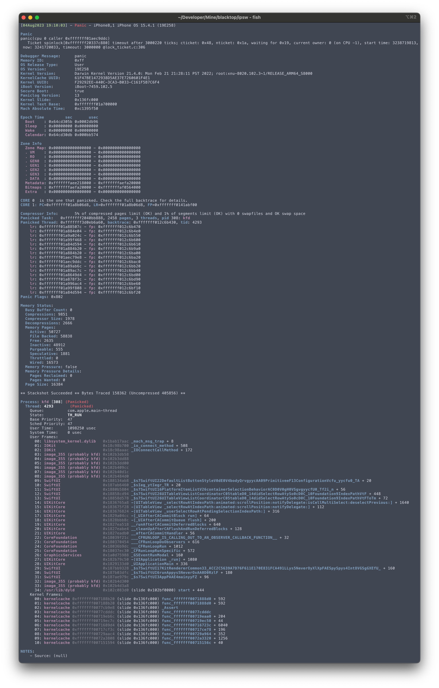

# Symbolicate Crashlogs

> This is useful for symbolicating crashlogs you have collected from a device you don't have access to

`ipsw` will detect the `dyld_shared_cache` needed to symbolicate the **userspace** crashlog

```bash
❯ ipsw symbolicate solitaire-2021-02-23-185510.ips

   ⨯ please supply a dyld_shared_cache for iPhone12,1 running 14.5 (18E5154f)
```

You can download the required `dyld_shared_cache` like so

```bash
❯ ipsw download ipsw --device iPhone12,1 --version 14.5
```

To extract the `dyld_shared_cache` from the downloaded IPSW file

```bash
❯ ipsw extract --dyld <IPSW.ipsw>
```

You can download the current `beta` shared caches like so

```bash
❯ ipsw download ota --platform ios --device iPhone12,1 --beta --dyld
? You are about to download 1 OTA files. Continue? Yes
   • Parsing remote OTA        build=18E5154f device=iPhone12,1 iPhone11,8 version=iOS145DevBeta2
   • Extracting remote dyld_shared_cache (can be a bit CPU intensive)
```

Now you can symbolicate the crashlog

```bash
❯ ipsw symbolicate solitaire-2021-02-23-185510.ips dyld_shared_cache_arm64e

Process:             solitaire [12345]
Hardware Model:      iPhone12,1
OS Version:          14.5
BuildID:             18E5154f

Exception Type:      EXC_BAD_ACCESS (SIGSEGV)
Exception Subtype:
KERN_INVALID_ADDRESS at 0x0000020000000010 -> 0x0000000000000010 (possible pointer authentication failure)
VM Region Info: 0x10 is not in any region.  Bytes before following region: 4363091952
      REGION TYPE                 START - END      [ VSIZE] PRT/MAX SHRMOD  REGION DETAIL
      UNUSED SPACE AT START
--->
      __TEXT                   1040f8000-1040fc000 [   16K] r-x/r-x SM=COW  ...app/solitaire

Termination Signal:  Segmentation fault: 11
Termination Reason:  Namespace SIGNAL, Code 0xb
Terminating Process: exc handler [12345]
Triggered by Thread: 45

Thread 45 name: Dispatch queue: CTTelephonyNetworkInfo
Thread 45 Crashed:
  0: libobjc.A.dylib         (slide=0x27010000) 0x1bc39e1e0 _objc_msgSend + 32
  1: CoreFoundation          (slide=0x27010000) 0x1a734e76c -[__NSDictionaryM objectForKeyedSubscript:] + 184
  2: CoreTelephony           (slide=0x27010000) 0x1a79d1230 -[CTTelephonyNetworkInfo updateRat:descriptor:] + 144
  3: CoreTelephony           (slide=0x27010000) 0x1a79d1114 -[CTTelephonyNetworkInfo queryRatForDescriptor:] + 164
  4: CoreTelephony           (slide=0x27010000) 0x1a79cfe9c -[CTTelephonyNetworkInfo connectionStateChanged:connection:dataConnectionStatusInfo:] + 72
  5: CoreFoundation          (slide=0x27010000) 0x1a7476894 ___invoking___ + 148
  6: CoreFoundation          (slide=0x27010000) 0x1a734a054 -[NSInvocation invoke] + 380
  7: CoreFoundation          (slide=0x27010000) 0x1a734a658 -[NSInvocation invokeWithTarget:] + 80
  8: CoreTelephony           (slide=0x27010000) 0x1a79d9fb0 __ZZN8dispatch5asyncIZ50-[CoreTelephonyClientMux sink:handleNotification:]E3$_2EEvP16dispatch_queue_sNSt3__110unique_ptrIT_NS4_14default_deleteIS6_EEEEENUlPvE_8__invokeESA_ + 44
  9: libdispatch.dylib       (slide=0x27010000) 0x1a705e878 __dispatch_client_callout + 20
 10: libdispatch.dylib       (slide=0x27010000) 0x1a7066060 __dispatch_lane_serial_drain + 620
 11: libdispatch.dylib       (slide=0x27010000) 0x1a7066c5c __dispatch_lane_invoke + 404
 12: libdispatch.dylib       (slide=0x27010000) 0x1a7071518 __dispatch_workloop_worker_thread + 764
 13: libsystem_pthread.dylib (slide=0x27010000) 0x1f33ba7a4 __pthread_wqthread + 276
 14: libsystem_pthread.dylib (slide=0x27010000) 0x1f33c174c _start_wqthread + 8

Thread 45 State:
    x0: 0x00000002803e0047   x1: 0x00000001f6df3124   x2: 0x0000000281ed4000   x3: 0x00000001b6efb344
    x4: 0x00000000000062dc   x5: 0x0000000000000001   x6: 0x3130303030303030   x7: 0x0000000000000000
    x8: 0x00000001f6df3000   x9: 0xdb6091bce8b38b12  x10: 0x6ae10002803e0047  x11: 0x0000000281ed4021
   x12: 0x0000000281ed4021  x13: 0x0000020000000000  x14: 0x00000001a7604012  x15: 0x0000020000000000
   x16: 0x0000000000000000  x17: 0xd0357901a735c988  x18: 0x0000000000000000  x19: 0x0000000281ed4000
   x20: 0x00000001f6df3124  x21: 0x0000000000000003  x22: 0x00000002801de580  x23: 0x0000000000000003
   x24: 0x0000000000000001  x25: 0x000000020abc3520  x26: 0x0000000000000003  x27: 0x0000000000000000
   x28: 0x0000000000000104   fp: 0x000000016de0e780   lr: 0x00000001a734e76c
    sp: 0x000000016de0e740   pc: 0x00000001bc39e1e0 cpsr: 0x20001000
   esr: 0x92000004
```

:::info 
You can use the `--unslide` flag to unslide the crashlog for easier static analysis
:::

## 🆕 Symbol Server

### Setup Server

Databases supported:

- in-mem
- sqlite
- postgres

:::info 
Want another database driver supported? Make a [feature request](https://github.com/blacktop/ipsw/issues/new?assignees=blacktop&labels=enhancement%2Ctriage&projects=&template=feature.yaml)
:::

#### Install `postgres`

```bash
brew install postgresql@16
```

Start `postgres` either as service:

```bash
brew services start postgresql@16
```

Or manually:

```bash
LC_ALL="C" /opt/homebrew/opt/postgresql@16/bin/postgres -D /opt/homebrew/var/postgresql@16
```

### Create a `~/.config/ipsw/config.yml` with the following database info

```yaml
database:
  driver: postgres
  name: postgres
  host: localhost
  port: 5432
  user: blacktop
```

:::info
### To add kernel symbolication

Get the signatures

```bash
git clone https://github.com/blacktop/symbolicator.git
```

Add them to your `~/.config/ipsw/config.yml`

```yaml
daemon:
  sigs-dir: /path/to/blacktop/symbolicator/kernel
```

> For more information see [Kernel Symbolication](https://blacktop.github.io/ipsw/blog/kernel-symbolication)

:::

### Start `ipswd`

> `ipswd` is a *daemon* that exposes a subset of `ipsw`'s functionality as a RESTful API to allow for easier automation and use in large scale pipelines.

```bash
ipswd start
```

Here are the `ipswd` [API Docs](https://blacktop.github.io/ipsw/api)

### Scan an IPSW

Using [httpie](https://httpie.io)

```bash
http POST 'localhost:3993/v1/syms/scan' path==./IPSWs/iPad_Pro_HFR_17.4_21E219_Restore.ipsw
```

### Symbolicate a `panic`

The `symbolicate` command now supports the NEW panic/crash JSON format

```bash
❯ ipsw symbolicate --help
```
```bash
Symbolicate ARM 64-bit crash logs (similar to Apples symbolicatecrash)

Usage:
  ipsw symbolicate <CRASHLOG> [IPSW|DSC] [flags]

Aliases:
  symbolicate, sym

Flags:
  -a, --all             Show all threads in crashlog
  -d, --demangle        Demangle symbol names
  -h, --help            help for symbolicate
      --pem-db string   AEA pem DB JSON file
  -p, --proc string     Filter crashlog by process name
  -r, --running         Show all running (TH_RUN) threads in crashlog
  -s, --server string   Symbol Server DB URL
  -u, --unslide         Unslide the crashlog for easier static analysis

Global Flags:
      --color           colorize output
      --config string   config file (default is $HOME/.config/ipsw/config.yaml)
      --no-color        disable colorize output
  -V, --verbose         verbose output

Examples:
  # Symbolicate a panic crashlog (BugType=210) with an IPSW
  ❯ ipsw symbolicate panic-full-2024-03-21-004704.000.ips iPad_Pro_HFR_17.4_21E219_Restore.ipsw
  # Pretty print a crashlog (BugType=309) these are usually symbolicated by the OS
  ❯ ipsw symbolicate --color Delta-2024-04-20-135807.ips
  # Symbolicate a (old stype) crashlog (BugType=109) requiring a dyld_shared_cache to symbolicate
  ❯ ipsw symbolicate Delta-2024-04-20-135807.ips
	  ⨯ please supply a dyld_shared_cache for iPhone13,3 running 14.5 (18E5154f)
```

:::info  
Swagger Docs for the symbol server API are here [Syms API](https://blacktop.github.io/ipsw/api#tag/Syms)  
:::

Symbolicate a 210 panic using the symbol server

```bash
❯ ipsw symbolicate --server 'http://localhost:3993' panic-full-2023-08-04-191003.000.ips

   • Symbolicating 210 Panic with Symbol Server server=http://localhost:3993
```



> NOTE: panic is from [here](https://discord.com/channels/779134930265309195/782323285294841896/1137089549324005416)