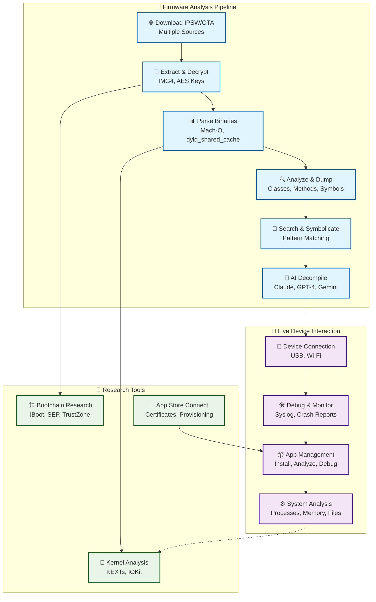

# Introduction

## What is ipsw 🤔

**ipsw** is a comprehensive command-line research framework for iOS and macOS that serves as your Swiss Army knife for Apple platform analysis. Whether you're a security researcher, reverse engineer, jailbreak developer, or iOS enthusiast, ipsw provides the tools you need to download, parse, analyze, and interact with Apple firmware and devices.

### Core Capabilities

- **📱 IPSW/OTA Analysis** - Download, extract, and analyze iOS firmware files from multiple sources
- **🔍 Binary Analysis** - Advanced Mach-O parsing with ARM disassembly and AI-powered decompilation  
- **🧠 dyld_shared_cache** - Complete shared cache analysis with ObjC/Swift class dumping
- **🔧 Kernel Analysis** - Kernelcache parsing, KEXT extraction, and symbolication
- **📲 Device Interaction** - Comprehensive iOS device management and debugging via `idev`
- **🔐 Firmware Research** - IMG4, iBoot, SEP, and co-processor firmware analysis
- **🏪 App Store Connect** - Full API integration for app and certificate management
- **🛠️ Developer Tools** - SSH, Frida integration, debugging, and reverse engineering utilities
- **🤖 AI-Powered Analysis** - Integrated decompiler with support for Claude, OpenAI, Gemini, and Ollama



## Quick Start

```bash
# Download latest iPhone 15 Pro firmware
ipsw download ipsw --device iPhone16,1 --latest

# Extract and analyze kernelcache
ipsw extract --kernel iPhone16,1_*.ipsw
ipsw kernel info kernelcache.*

# Connect and interact with device
ipsw idev list
ipsw idev syslog

# Analyze binary with AI decompiler
ipsw macho disass /path/to/binary --entry --dec --dec-model "Claude 3.5 Sonnet"
```

## Use Cases

### Security Research
- Vulnerability analysis and exploit development
- Firmware security assessment
- Binary reverse engineering with AI assistance

### Jailbreak Development  
- Bootchain analysis and exploitation
- Kernel extension research
- System modification and patching

### iOS Development
- App debugging and analysis
- Certificate and provisioning management
- Device testing and automation

### Digital Forensics
- Device data extraction and analysis
- Timeline reconstruction
- Artifact analysis

---

Ready to dive in? Start with our [Installation Guide](getting-started/installation.md) or explore the [comprehensive guides](category/guides) to learn about specific features.
