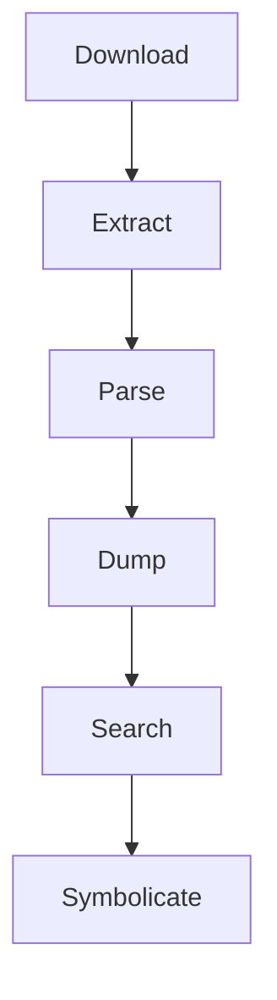

# Introduction

## What is ipsw 🤔

- IPSW downloader/exploder
- OTA downloader/exploder
- macho parser
- ObjC class-dump
- Swift class-dump 🚧
- dyld_shared_cache parser
- kernelcache parser
- img4 parser/decrypter
- device-tree parser
- ARM v9-a disassember
- research tool

